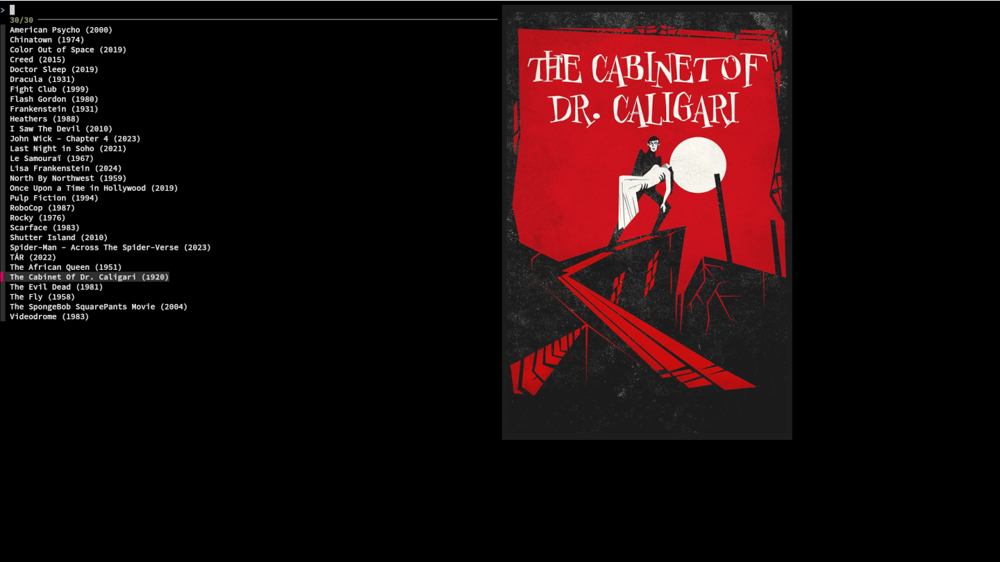

# Leisure
Leisure is a script that utilizes fzf to consolidate the searching and launching of entries in various types of media libraries.

Additionally, you can filter for a specific runner in the case of games.



## Table of Contents 
- [Supported Media Types](#supported-media-types) 
- [Dependencies](#dependencies) 
- [Installation](#installation) 
- [Configuration](#configuration) 
- [Preview Images](#preview-images) 
- [Supported Game Runners](#supported-game-runners) 
- [Usage](#usage) 
- [Special Thanks](#special-thanks) 
- [License](#license) 

## Supported Media Types
* Books
* Films
* Games
* TV Shows

## Dependencies
* fzf - prompt interface
* kitty - for image previews (optional)
* mpv - for playing videos (optional)
* zathura - for viewing ebooks (optional)

## Installation
Clone the repository and run the installation script
```sh
git clone https://github.com/nniemeir/leisure.git ~/leisure/
~/leisure/install
```
## Configuration
There are a few files that must be edited before using Leisure.

### paths.conf
This is where the paths to your media libraries will be held. If a path is not specified, its corresponding media type will be omitted. 

### games.csv
This file should contain an entry for each game you have installed. Due to the number of supported game runners, entries must be added manually in the following format:
```
Title;Runner;ID or ROM filename
Todd of Lore 4;Steam;377160
Nuke Dookthem 3D;Lutris;6
Grand Theft Walrus;PCSX2;GTW.iso
```

## Preview Images
Image previews are available for Leisure under Kitty terminal's icat protocol. 

Currently, these must be manually added to the previews directory in your config directory (~/.config/leisure/ by default).

To do so, place a PNG file with the same basename as the corresponding category or entry in the list.


## Supported Game Runners
For a runner to appear, it must be installed and an entry using it in **games.csv** must exist. In the case of emulators, they must be installed via flatpak and their corresponding path must be set in paths.conf. 
* BlastEm
* bsnes
* DeSmuME
* Dolphin
* Flycast
* Heroic
* Lutris
* mGBA
* Nestopia
* PCSX2
* PPSSPP
* RPCS3
* Steam

## Usage
```
leisure [OPTIONS]
```

### Options
```
-c <directory>          Specify a configuration directory
-h                      Display this message
-n                      Disable preview images
-v                      Display version number
```

## Special Thanks
[fzf](https://github.com/junegunn/fzf)

[kitty](https://github.com/kovidgoyal/kitty)

## License
The MIT License (MIT)

Copyright (c) 2025 Jacob Niemeir
